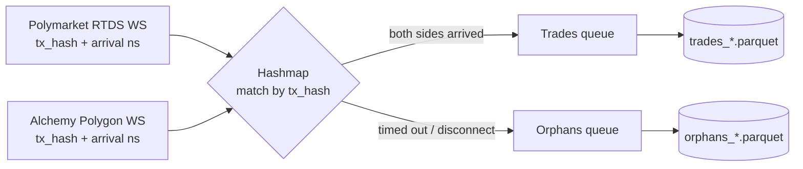

# Polymarket RTDS vs. Alchemy: WebSocket Latency Benchmark


A latency benchmark for **same-trade detection** on Polymarket. The tool subscribes to two independent live data sources at the same time, matches the trades they each report, and records how much sooner one source reported a given trade than the other. The result is a clean Parquet file ready for analysis.

The two sources being compared:

- **Polymarket RTDS**: Polymarket's first-party Real-Time Data Service WebSocket (`wss://ws-live-data.polymarket.com`), which streams trade activity directly. No authentication required.
- **Alchemy**: an Alchemy Polygon WebSocket that streams the on-chain `OrderFilled` logs emitted by Polymarket's exchange contracts. Requires an Alchemy API key.

Every trade (across both sources) contains a `transactionHash`, which is what lets this tool match them together, and measure the time gap between them.

---

## Why this exists

This is a personal research project with three goals:

- **A proof of concept** for a larger project that will support multiple RPC nodes, followed by a dedicated analysis tool built on top of it.
- **Picking the fastest source** for same-trade detection to inform a trading system.
- **Building something usable by others**, not just something for myself, hence the setup docs and license below.

---

## How it works



1. **Two listeners run concurrently.** Each one timestamps every incoming trade the instant it arrives, using a high-resolution monotonic clock (`time.perf_counter_ns()`), and records the trade's `transactionHash`.

2. **Trades are matched by `transactionHash` in an in-memory hashmap.** The first arrival from a source creates an entry. When the *other* source reports the same hash, the trade is considered matched. If the same source reports the same hash more than once (should never happen), only the first arrival is kept (duplicates are discarded to preserve the earliest timestamp).

3. **Matched trades are written to `trades_*.parquet`**, including the latency difference between the two sources (see [Output](#output)).

4. **Unmatched trades become "orphans."** A trade can fail to match for two reasons:
   - **`unmatched`**: only one source ever reported it within the match window (default 60s; editable in config), so it's evicted by a periodic sweep.
   - **`cleared_on_disconnect`**: a connection (to a source) dropped while the trade was still waiting for its pair, so the hashmap was cleared.

   Either way it's recorded in `orphans_*.parquet` with the reason, so no trades should ever be lost.

5. **Trades are only stored in the hashmap when both subscriptions are live.** If either connection drops, then collection pauses, the hashmap is cleared, and the tool reconnects with exponential backoff capped at a ceiling (default 30s; editable in config), but resets back to the base delay (default 1s; editable in config) as soon as both subscriptions are live again. This prevents the hashmap from filling with trades that could never be matched.

---

## Output

Each run writes two timestamped Parquet files to the `output/` directory (created automatically, git-ignored):

- `trades_<timestamp>.parquet`
- `orphans_<timestamp>.parquet`

where `<timestamp>` is the run's start time, e.g. `trades_2026-06-12T09-30-00.parquet`.

### `trades_*.parquet` — matched trades

| Column           | Type    | Description                                                              |
| ---------------- | ------- | ----------------------------------------------------------------------- |
| `tx_hash`        | string  | Transaction hash shared by both sources.                                |
| `poly_rel_ns`    | int64   | Polymarket RTDS arrival time, in ns relative to run start.              |
| `alchemy_rel_ns` | int64   | Alchemy arrival time, in ns relative to run start.                      |
| `delta_ns`       | int64   | `poly_rel_ns − alchemy_rel_ns`: the latency gap (see below).    |

**Reading `delta_ns`:**

- **`delta_ns > 0`** → Polymarket arrived *later* → **Alchemy detected the trade first**.
- **`delta_ns < 0`** → Polymarket arrived *earlier* → **Polymarket detected the trade first**.
- The magnitude is the gap in nanoseconds (for reference: 1,000,000 ns = 1 ms).

### `orphans_*.parquet` — unmatched trades

| Column         | Type   | Description                                                       |
| -------------- | ------ | ---------------------------------------------------------------- |
| `tx_hash`      | string | Transaction hash that never got a pair.                          |
| `arrived_side` | string | Which source *did* report it: `"polymarket"` or `"alchemy"`.     |
| `rel_ns`       | int64  | Arrival time of the side that reported it, in ns from run start. |
| `reason`       | string | `"unmatched"` or `"cleared_on_disconnect"`.                      |

> **A note on the timestamps:** all `*_rel_ns` values are nanosecond offsets from the moment the run started, taken from a monotonic performance counter... **not** wall-clock time. They are only meaningful *relative to each other within the same run* and should not be compared across runs or interpreted as a calendar time. For latency analysis, `delta_ns` is the quantity you want; the per-source `rel_ns` values mainly exist to derive it.

---

## Requirements

- **Windows** (instructions below are Windows / PowerShell specific).
- **Python 3.10 or newer.**
- **An Alchemy API key** with access to a **Polygon Mainnet** WebSocket endpoint. Sign up for free at [alchemy.com](https://www.alchemy.com/), create a new app, select the Polygon network, and copy its API key.

Python dependencies (installed via the steps below):

```
websockets>=13.0
pyarrow>=14.0
```

---

## Setup
 
**1. Get the code and open it in PowerShell.**
 
Clone the repository (requires [Git](https://git-scm.com/)), or download the ZIP from GitHub and extract it. Then `cd` into the project root. All remaining commands are run from there.
 
```powershell
git clone https://github.com/nickslept/Polymarket-RTDS-vs.-Alchemy-WebSocket-Latency-Benchmark.git
cd Polymarket-RTDS-vs.-Alchemy-WebSocket-Latency-Benchmark
```
 
**2. Create and activate a virtual environment:**
 
```powershell
python -m venv .venv
.venv\Scripts\activate
```
 
**3. Install dependencies:**
 
```powershell
pip install -r Requirements.txt
```
 
**4. Set your Alchemy API key.**
 
```powershell
$env:ALCHEMY_API_KEY="your_key_here"
```

---

## Usage

With the virtual environment active and the API key set, start a collection run:

```powershell
python main.py
```

The tool will:

1. Confirm both subscriptions are live (`Both subscriptions live. Collecting data...`).
2. Begin matching trades and periodically flush batches to disk, logging progress as it goes.

It runs continuously, collecting for as long as you leave it open.

### Stopping a run

Press **`Ctrl+C`** to stop. This is the intended way to end a run. It triggers a clean shutdown that **drains any buffered and queued rows to disk before exiting**, so the trades and orphans you've collected are saved. You'll see a `successfully shutdown` message once it's done.

---

## Configuration

Everything modifiable can be found in `config.py`:
 
| Setting                     | Default | Purpose                                                              |
| --------------------------- | ------- | -------------------------------------------------------------------- |
| `FLUSH_ROW_THRESHOLD`       | `100`   | Maximum number of rows held in the in-memory buffer before they're written out to the Parquet file (or after `FLUSH_INTERVAL_SECONDS` seconds, whichever comes first).      |
| `FLUSH_INTERVAL_SECONDS`    | `10`    | Maximum time (in seconds) buffered rows wait before being written to the Parquet file (or after `FLUSH_ROW_THRESHOLD` rows accumulate, whichever comes first).  |
| `MATCH_TIMEOUT_SECONDS`     | `60`    | How long an unmatched trade waits in the hashmap before it's evicted as an orphan. |
| `EVICTION_INTERVAL_SECONDS` | `30`    | How often the hashmap is swept, checking & removing old unmatched trades.           |
| `RECONNECT_BASE_SECONDS`    | `1`     | Initial reconnect delay; the backoff also resets to this value once both subscriptions are live again. |
| `RECONNECT_MAX_SECONDS`     | `30`    | Maximum reconnect delay (backoff doubles on consecutive failures up to this ceiling). |
| `SUB_ACK_TIMEOUT_SECONDS`   | `30`    | Maximum time (in seconds) to wait for both subscriptions to come up before retrying. Note: ack expected only from Alchemy.  |
| `OUTPUT_DIR`                | `output`| Directory where Parquet files are written.                           |

### Contract addresses & event topic

`config.py` also hardcodes the contract addresses and event topic the Alchemy listener filters for:

| Constant                   | Value                                          |
| -------------------------- | ---------------------------------------------- |
| `CTF_EXCHANGE_V2`          | `0xE111180000d2663C0091e4f400237545B87B996B`   |
| `NEG_RISK_CTF_EXCHANGE_V2` | `0xe2222d279d744050d28e00520010520000310F59`   |
| `ORDER_FILLED_TOPIC`       | `0xd543adfd945773f1a62f74f0ee55a5e3b9b1a28262980ba90b1a89f2ea84d8ee` |

These are the current **Polymarket V2 exchange contracts on Polygon mainnet** (Chain ID 137) and the `OrderFilled` event topic, pulled from PolygonScan. Polymarket migrated from V1 to these V2 contracts in 2026, so the addresses *can* change again. If this happens, update these values here and the Alchemy listener *should* continue working as intended (unless Alchemy changes its WebSocket endpoint or authentication scheme).

---

## Roadmap

Future direction (this tool is the proof of concept):

- **Multi-RPC-node support**: extend the benchmark beyond a single Alchemy endpoint to compare detection latency across multiple RPC providers / nodes.
- **A dedicated analysis tool**: built on top of the larger multi-node project, to analyze and visualize the collected latency data.

---

## License

Released under the [MIT License](LICENSE).

Copyright (c) 2026 Nick Sleptsov